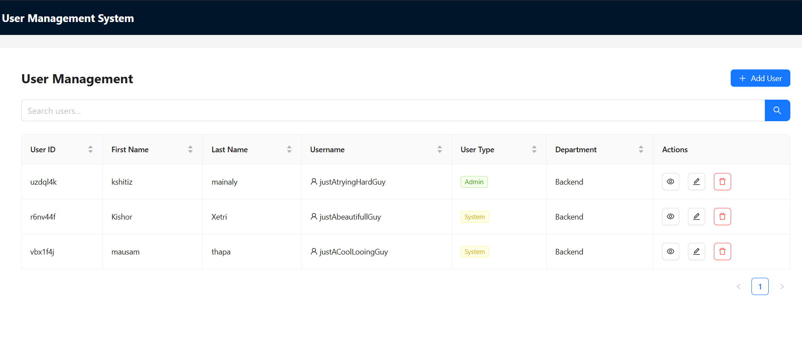

# User Management Dashboard  
*A React-based admin panel for managing users with CRUD operations.*  

## Preview my code at
**[Live Demo on Netlify](myDuumywebsite.com)**  

##  **Features**  
- View, create, edit, and delete users  
- Data persistence via `localStorage`  

 ## techStack Used  
- **Frontend**: React  
- **UI**: Ant Design + Tailwind CSS  
- **Routing**: React Router  

---

## 🧑‍💻 Author  
Created by **Kshitiz Mainaly**– **[connect on LinkedIn](https://www.linkedin.com/in/kshitiz-mainali-2a7a65298/)**

---
